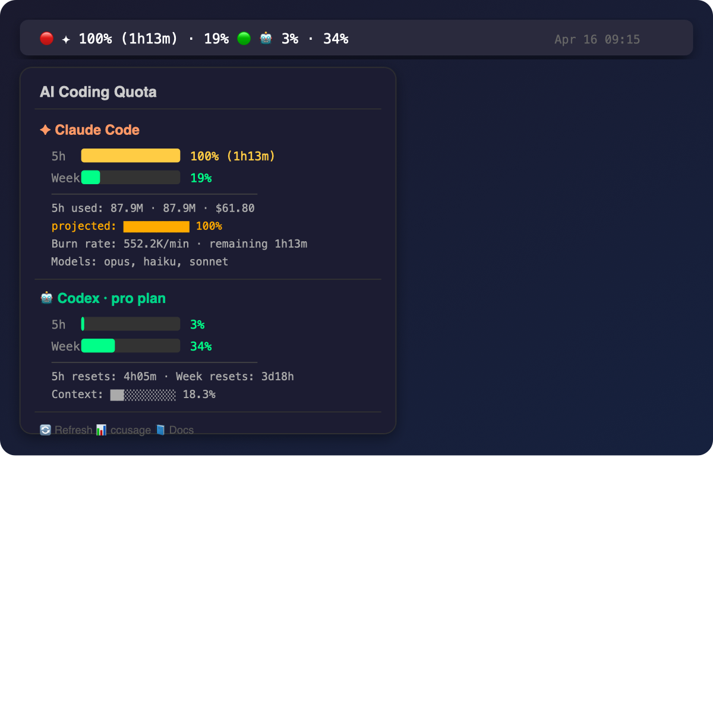

# AIPulse

> AI 编程订阅的"脉搏"，常驻你的 macOS 菜单栏。

**AIPulse** 是一个极简的 SwiftBar 插件，实时显示 [Claude Code](https://claude.com/claude-code) 和 [Codex](https://github.com/openai/codex-cli) 的 **5 小时**和**周**配额使用百分比 —— 再也不会写着写着突然被限流。

```
✦ 4.1% · 35.4%   🤖 12% · 33%
```

[English](README.md) · [提 issue](https://github.com/kami/aipulse/issues) · [作者 Kami](https://github.com/kami)

---

## 特性

- **零配置** — 自动检测本地的 Claude Code / Codex 数据
- **双窗口** — 5h 滑动窗口 + 周窗口并排显示
- **官方数据** — Codex 直读 OpenAI 下发的 `rate_limits`；Claude 通过 [`ccusage`](https://github.com/ryoppippi/ccusage) 本地解析
- **预测** — 按当前燃烧速率预测 5h 窗口末的百分比
- **上下文占用** — Codex 专属：当前会话 tokens / context window
- **多语言** — 英文 / 中文 (`AIPULSE_LANG=en|zh`)
- **主题** — cyberpunk（默认）/ mono
- **优雅降级** — 只装一个工具也能正常工作
- **隐私** — 100% 本地，不联网

## 截图



## 依赖

- macOS 11+
- [SwiftBar](https://swiftbar.app)（安装脚本自动处理）
- `node` ≥ 18（`brew install node`）
- 以下二者至少一个：**Claude Code** (`~/.claude/projects/`) 或 **Codex** (`~/.codex/sessions/`)

## 安装

```bash
curl -fsSL https://raw.githubusercontent.com/kami/aipulse/main/install.sh | bash
```

或手动：

```bash
git clone https://github.com/kami/aipulse.git
cd aipulse
./install.sh
```

## 配置

编辑 `~/.config/aipulse/config.sh`：

| 变量 | 默认 | 说明 |
|---|---|---|
| `AIPULSE_LANG` | `en` | 语言：`en` \| `zh` |
| `AIPULSE_THEME` | `cyberpunk` | 主题：`cyberpunk` \| `mono` |
| `AIPULSE_HIDE_CLAUDE` | `0` | 设 `1` 隐藏 Claude 板块 |
| `AIPULSE_HIDE_CODEX` | `0` | 设 `1` 隐藏 Codex 板块 |
| `AIPULSE_CC_5H_LIMIT` | `max` | `max`（历史峰值）或固定 token 数 |
| `AIPULSE_CC_WEEK_LIMIT` | `max` | 同上，针对周 |
| `AIPULSE_THRESH_INFO` | `50` | 绿 → 青阈值（%） |
| `AIPULSE_THRESH_WARN` | `70` | 黄色阈值 |
| `AIPULSE_THRESH_DANGER` | `90` | 红色阈值 |
| `AIPULSE_SHOW_COST` | `1` | 是否显示 `$` 金额 |

改完在 SwiftBar 菜单里点 **Refresh**（或等一分钟自动刷新）。

## 原理

### Claude Code

Anthropic **没有公开** Claude Pro/Max 订阅的精确 token 上限。AIPulse 用 [`ccusage`](https://github.com/ryoppippi/ccusage) 的 `--token-limit max` —— 把你**历史上最高的一次 5h 窗口消耗**作为 100% 基准。这是社区公认的务实做法。

如果你知道自己的大致上限（比如 Max 套餐 ~200M tokens/5h），设置 `AIPULSE_CC_5H_LIMIT=200000000` 即可。

### Codex

Codex CLI 的 session 保存在 `~/.codex/sessions/YYYY/MM/DD/rollout-*.jsonl`。每次 API 响应都会带一个 `rate_limits` 块，包含 `primary`（5h）和 `secondary`（周）的精确百分比 —— 这是 **OpenAI 服务端直接下发**的数字，Codex 自己也是这么用的。

如果 `resets_at` 时间已过，会显示 `⟳ last X%` 提示该窗口已重置。

## 常见问题

**Q: 支持 Cursor / Aider / Gemini CLI 吗？**
目前还没。架构是可扩展的，欢迎 PR。

**Q: Claude 百分比为什么偶尔超过 100%？**
因为基准是你历史最高值。如果创了新纪录，下次刷新会重新校准。

**Q: Codex 显示 `unknown plan`？**
最新那次会话没带 `plan_type`。打开 Codex 随便问一句再刷新就好。

**Q: 怎么改刷新频率？**
重命名文件：`aipulse.30s.sh`（30 秒）、`aipulse.5m.sh`（5 分钟）等。

**Q: 耗电吗？**
基本可忽略。每次只读本地文件，不联网。`npx ccusage` 第一次会下载，之后走缓存。

## 隐私

AIPulse **不会**：
- 发送任何数据
- 需要 API key
- 需要登录
- 写入分析

它只读你 CLI 工具已经写在本地的文件。

## 贡献

欢迎 PR，特别是：
- 支持其他 AI 编程工具（Cursor、Aider、Gemini CLI、Windsurf 等）
- 新主题 / 新语言

架构：每个工具是一个 `fetch_*` bash 函数，返回 JSON。新增一个插进去就行。

## 许可

MIT © [Kami](https://github.com/kami)

## 致谢

- [ccusage](https://github.com/ryoppippi/ccusage) by @ryoppippi —— Claude token 统计的重活全靠它
- [SwiftBar](https://swiftbar.app) —— 让 macOS 菜单栏插件变得极简
- Anthropic & OpenAI —— 感谢（暂时）没有加密本地日志文件 🙏
